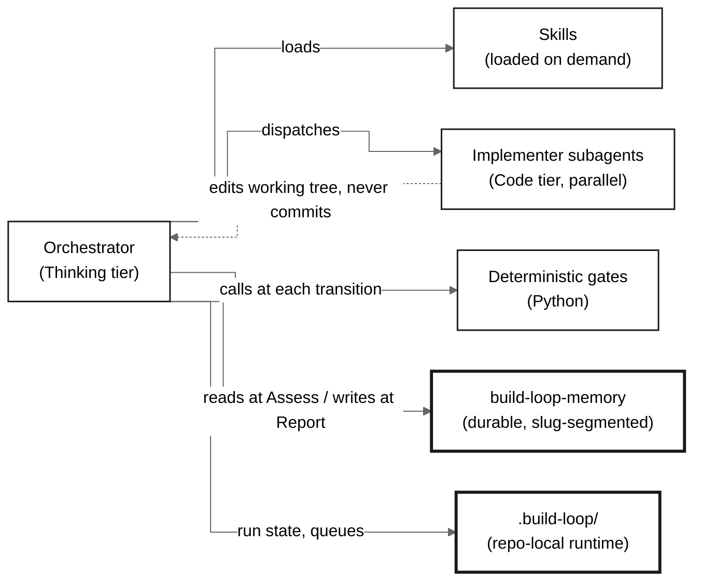
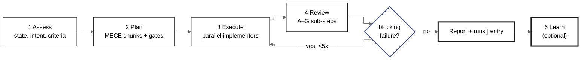
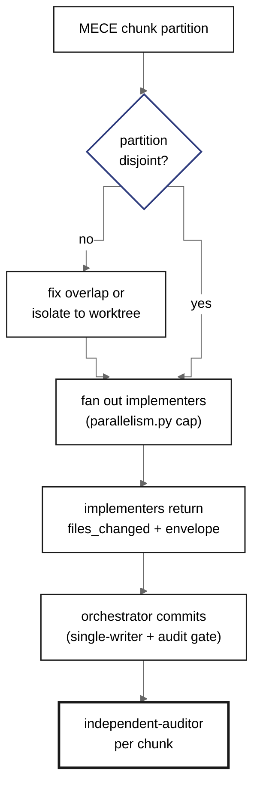
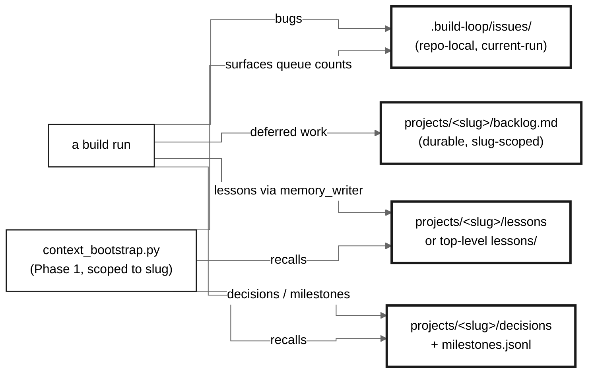

<!-- SPDX-FileCopyrightText: 2026 Tyrone Ross, Jr | SPDX-License-Identifier: Apache-2.0 -->
# Build Loop Architecture

**The big thing:** Build Loop is an orchestrated 5-phase development loop (+1 optional) for significant code changes. A Thinking-tier orchestrator reads the intent, plans the work, dispatches Code-tier implementer subagents in parallel where it's safe, reviews the result adversarially, and iterates — with **deterministic gates** guarding every transition and **durable memory** carrying decisions and lessons across runs. Most of the *logic* is prompts (markdown); the *gates and helpers* are Python; a small TypeScript layer exposes an MCP incident-memory server.

**Why it matters for you:** big changes get planned, executed in parallel where safe, and checked before they land — so the diff matches the plan, an implementer can't make silent design calls you never see, tests-pass-but-broken is caught, fake data can't reach production, and the loop *learns* instead of repeating mistakes.

## Core structure

Three layers, one loop. **Orchestration** (prompts) decides what happens and when. **Gates & helpers** (Python) are deterministic checks the orchestrator calls at each transition — the things a prompt can't be trusted to do by eye. **Memory** persists knowledge across runs and repos.

Standard borders are active parts; heavy borders are stores. The solid edges are the orchestrator's control path; the dashed edge is the single-writer contract — implementers return changes, the orchestrator owns `.git/`.

## The loop

Five phases plus an optional sixth. Review is itself seven ordered sub-steps. Iterate loops back to Review on a blocking failure, capped at 5.

Each phase calls deterministic gates: Plan runs `plan_verify.py` (a code-shipping plan must declare its reads-from dependencies, name every design decision, etc.); Execute runs the single-writer commit path with `audit_before_commit.py` on every commit; Review-G runs `write_run_entry.py --scope build`, which **blocks Report** if a code build lacks a real `independent-auditor` verdict. The orchestrator never grades its own diff unchecked.

**Why it matters:** the structure is what stops the common failure modes — plan drift, silent implementer design calls, green-tests-broken-page, mock-data-as-real — rather than relying on a careful reviewer to notice each one.

## How a change gets executed (Phase 3)

The orchestrator decomposes the plan into MECE chunks (disjoint file ownership), validates the partition, then fans out Code-tier implementers in parallel up to a machine-aware cap. Implementers edit and return; the orchestrator commits sequentially through the gate.

**Why it matters:** parallel work needs disjoint ownership or two writers race the same file. `parallelism.py --check-partition` makes that a pre-dispatch check, not a post-mortem; the single-writer commit contract prevents the parallel-commit race that once lost 3 of 4 commits.

## How memory flows (write / read / track)

Three artifact lanes, each repo-segmented so work on one repo never reads or writes another's. Reads scope to the current project's slug; nothing pulls all-projects context.

**Why it matters:** decisions and lessons survive across sessions and machines (durable, in `build-loop-memory`), while per-run bug/work tracking stays in the repo. The slug folder is the segmentation key — a cross-repo item is recorded in *its* repo's scope, never the current one's.

## Key decisions

Each choice traces to a reason and a user-visible effect.

| Decision | Why | What it means for you |
|---|---|---|
| Orchestration is prompts (markdown), not code | Portable and host-neutral; the same method runs under Claude Code, Codex, or any agent host via `AGENTS.md` | The loop isn't locked to one tool; logic is readable and editable as text |
| Model tiering (Thinking / Code / Pattern) | A wrong spec at the steering layer costs more than tokens; mechanical work doesn't need a frontier model | Strong model plans and reviews, faster model writes code, cheap model pattern-checks — cost tracks value |
| Deterministic gates *and* LLM judges | grep-checkable rules catch what an LLM drifts on; an adversarial judge catches what a rule can't express | A plan can't ship with an unwritten read-path; a code build can't reach Report without a real auditor verdict |
| Single-writer git contract | Two writers racing `HEAD`/index lose commits | Parallel implementers never collide; the orchestrator owns every commit |
| Reversible by default (bundle-first, worktrees, collapse-to-main) | Safe autonomy means the undo is always cheap | Risky work runs isolated and merges back; every destructive step is bundled first |
| Durable memory separate from runtime, slug-segmented | Knowledge must outlive a session and not mix repos | Lessons/decisions persist and recall scoped to the repo you're in |
| Self-modification behind a test gate | The loop edits its own code; that must not break itself | `self_mod_verify.py` runs the suite and auto-reverts on failure — build-loop can improve itself safely |
| One mandatory human gate (irreversible / production / major) | Reversible work shouldn't ask permission; irreversible work must | The loop keeps going on two-way doors and stops only on the genuine one-way doors |

## Components

What each layer is and how to work in it. Line counts are real (this repo, 2026-05-31); tests are counted separately. NavGator's import-graph sees ~52 components / 122 connections, but it undercounts: skills and agents dispatch *by name* (prompts), not by `import`, so most edges are name-based and invisible to a static graph.

How to decide where to work: **build on top** when a seam already exists (a new gate script the orchestrator calls, a new skill it loads, a new optional field in a return envelope). **Build adjacent** when your feature is a new consumer that adds nothing to the core loop (a new runtime-smoke adapter, a new companion skill). **Replace** only when a method, not its interface, is the problem (e.g. a recall matcher), keeping the contract the orchestrator depends on intact.

**1. Orchestrator — the brain (~916 lines of prompt).** `agents/build-orchestrator.md` (427) + `skills/build-loop/SKILL.md` (489). Decides phase flow, when to fan out vs run inline (dual-mode), what to dispatch, and which gates to call. This is the single most load-bearing file pair; everything else is something it loads or calls.
- *Why:* one place owns the method, so behavior is consistent regardless of how the run was started (Skill, Agent tool, per-commit, resume).
- *Key assumptions:* the host can load skills on demand and dispatch subagents; gates are exit-code contracts it can trust.
- *Tradeoffs:* a large prompt is powerful but must be kept disciplined (progressive disclosure into `references/` keeps it navigable).
- *Interdependencies:* loads every skill, dispatches every agent, calls the gates. Changing a phase contract ripples here first.

**2. Skills — the procedural library (42 SKILL.md).** Loaded on demand, not pre-loaded. The 6 phase references (`references/phase-*.md`) plus capability skills (telemetry, ui-design, authentication, debugging-memory, model-tiering, leadership doctrine, …). Each is prompt knowledge with a clear trigger.
- *Why:* keep the orchestrator lean; pull deep procedure only when the phase needs it.
- *Tradeoffs:* many skills risk proliferation — the rule is extend an existing skill before adding one, drop a skill not used twice.
- *Interdependencies:* the orchestrator + `capability-routing.md` decide which load when.

**3. Deterministic gates & helpers (221 Python scripts, ~66k lines; 95 are tests).** The checks and glue a prompt can't be trusted to do by eye: `plan_verify.py`, `autonomy_gate.py` / `classify_action.py`, `audit_before_commit.py`, `write_run_entry/` (the Report gate), `context_bootstrap.py`, `memory_writer.py` / `write_decision/`, `append_milestone.py`, `parallelism.py`, `self_mod_verify.py`, `collapse_run.py`, the runtime-smoke adapters, and the memory facade.
- *Why:* exit-code contracts make transitions verifiable instead of vibes; every script that lands ships with a colocated `test_*.py`.
- *Key assumptions:* gates are fail-soft where they're advisory (telemetry, staleness) and hard-blocking only where correctness demands (secrets, missing auditor, unwritten read-path).
- *Tradeoffs:* a lot of surface (221 files) — kept honest by the rule that a new mechanism must earn its place against a *named, observed* failure, and by archiving dead scripts.
- *Interdependencies:* called by the orchestrator at phase boundaries; the memory facade is the one source of truth for reading the durable store.

**4. Subagents (26 agent definitions).** `implementer` (Code tier, the workhorse), `independent-auditor` (adversarial review), `scope-auditor`, `plan-critic`, `fact-checker`, `mock-scanner`, the domain assessors, `recurring-pattern-detector` + `self-improvement-architect` (Learn), and more. Each has a tier and a single job.
- *Why:* context isolation and the right model per task; the orchestrator stays the only thing with the full picture.
- *Tradeoffs:* a hard cap of 4 parallel keeps the multi-agent token multiplier in check.
- *Interdependencies:* dispatched by the orchestrator with a MECE ownership packet; they never commit.

**5. Memory system (durable + runtime).** `build-loop-memory/` (separate repo: `projects/<slug>/` for project-scoped backlog, decisions, milestones, lessons; top-level `lessons/`, `design/`, `debugging/`, `product/` for cross-project) plus `.build-loop/` in each consumer repo (runtime state, queues, context snapshots — gitignored). Written only through `memory_writer.py` / `write_decision/`; read through the facade + `context_bootstrap.py`.
- *Why:* knowledge must outlive a session and not leak across repos; provenance and slug-segmentation make cross-repo trust and scoping mechanical.
- *Interdependencies:* Phase 1 reads it; Review-G writes the run entry + milestone. See `skills/build-loop/references/memory.md` for the full lane/segmentation contract.

**6. MCP incident-memory server (37 TypeScript files).** `src/` + `cli/`, compiled to `dist/`. Exposes the bundled debugger's cross-session incident memory as an MCP server and a small CLI; published as `@tyroneross/build-loop` to GitHub Packages.
- *Why:* the debugger is invoked from inside the loop on every Review-B / Iterate failure; an MCP surface lets the incident memory be queried as a tool.
- *Interdependencies:* the only compiled artifact; `prepublishOnly` builds it. Layer-bounded except one known type-import inversion in `tools.ts` (tracked).

## Limits we hold

Fixed invariants that keep autonomy safe and runs honest: implementers never commit (single-writer git); every destructive step is bundle-first and reversible (worktrees collapse to `main` at closeout); self-modifications pass `self_mod_verify.py` or auto-revert; a code build cannot reach Report without a real `independent-auditor` verdict; a plan cannot ship with an `unverified` reads-from dependency; only production / irreversible / major decisions gate on a human; no mock data in production paths and no unverified claims; backlog/issues/lessons are repo-segmented and never mixed across repos.

## What we deliberately did not build

No always-on daemon in core (the monitoring/resume daemon belongs in a separate `build-loop-monitor` plugin). No auto-merge of review-hold branches. No hard gate on code size or complexity — large is never a reason to stop, only to decompose. No provider lock-in — model roles are assigned by tier, and any host that meets the tier contract substitutes. No UI surfaces embedded in the loop (viewer dashboards stay external; only mockup drafting is an authorized in-loop plugin call).

**Bottom line:** a Thinking-tier orchestrator that plans and reviews, Code-tier implementers that write in parallel under a single-writer contract, deterministic gates that make every transition verifiable, and durable slug-segmented memory that learns across runs. That split — prompts for judgment, Python for the checks, separate stores for what must persist — is what lets the loop take on big changes autonomously without the diff drifting, an implementer going rogue, or the same mistake landing twice.
