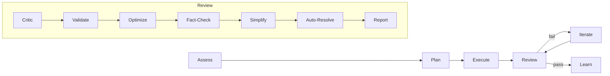

<!-- build-loop@tyroneross:canary:build-loop -->
<!-- canary-end -->
# build-loop

A portable, multi-phase build loop for AI coding agents. It gives Claude Code, Codex, and any AGENTS.md-aware tool the same disciplined operating loop: assess, plan, execute, review, iterate, then learn.

> **Summary:** build-loop helps AI coding agents and the developers who run them ship multi-step code changes by running every change through a planned, reviewed, verified loop. Best for non-trivial features, refactors, migrations, and bug hunts across more than one file. Skip it for one-line edits, pure Q&A, or status checks.

[](LICENSE)
[](https://github.com/tyroneross/build-loop/pkgs/npm/build-loop)
[](#install)

## Why build-loop

Hand an agent a multi-step task and it tends to dive straight into edits, with no plan, no scope boundary, and no independent check that the result matches the goal. The failures compound: wrong assumptions ride into code, fixes patch symptoms, and "it compiles" gets reported as "it works."

build-loop replaces that with a **structured loop every change runs through**: it assesses live repo state and memory, plans with explicit file ownership and pass/fail criteria, executes within scope, then runs an adversarial review (a critic, a fact-checker, a mock-data scanner) before iterating to green. The differentiator is portability and verification: the **same loop runs across Claude Code, Codex, and host-neutral AGENTS.md tools**, it is **multi-model by tier** (a frontier model plans and judges, a coding model executes), and **no completion claim ships without a verification step behind it**.

## The loop



Assess → Plan → Execute → Review → Iterate (5x max) → Learn (always emits an outcome). Review runs seven ordered sub-steps; Iterate loops back to Review on failure.

For the **living, auto-generated diagram** of how the loop actually wires up in this repo, covering every phase, gate, agent, skill, and script and regenerated from source so it cannot drift, open [`docs/build-loop-flow-mockup.html`](docs/build-loop-flow-mockup.html) in a browser. Format spec and drift gate: [`architecture/README.md`](architecture/README.md).

## Quick start

Install for all three host surfaces on macOS:

```bash
npm install -g @tyroneross/build-loop@0.36.1
build-loop-install --host all
```

Then, in a Claude Code session inside your project, hand the loop a task:

```text
/build-loop:run add billing settings with tests
```

What you observe: the agent prints a short status line per phase (`[Phase 1: Assess]`, `[Phase 2: Plan]`, `[Phase 3: Execute]`, then each Review sub-step), then ends with a scorecard marking every acceptance criterion ✅ / ⚠️ / ❓. Completed, verified work is committed automatically; the only human-confirmation gates are production push, irreversible delete, and major user-impacting decisions.

You do not pick a mode. `/build-loop:run` auto-routes build, fix, refactor, optimize, research, and test requests to the right path.

## Install

`build-loop-install` runs the package's helpers from the installed npm package:

- Syncs the Claude Code cache from the package root.
- Syncs the Codex cache from `plugin-artifacts/codex`, the slim Codex install artifact.
- Bootstraps the build-loop memory root with public templates.
- Leaves publishing, GitHub releases, and production deploys to explicit release commands.

For GitHub Packages, authenticate first and point the `@tyroneross` scope at the GitHub registry:

```bash
npm config set @tyroneross:registry https://npm.pkg.github.com
npm login --scope=@tyroneross --registry=https://npm.pkg.github.com
npm install -g @tyroneross/build-loop@0.36.1
build-loop-install --host all
```

Installer options:

| Option | Use |
|---|---|
| `--host claude` | Sync only the Claude Code cache. |
| `--host codex` | Sync only the Codex cache. |
| `--host all` | Sync both caches. This is the default. |
| `--project <slug>` | Ensure `projects/<slug>/raw/` exists in build-loop memory. Repeatable. |
| `--memory-dest <path>` | Override the memory root. |
| `--skip-memory` | Sync plugin caches only. |
| `--dry-run` | Show cache sync actions without writing. |
| `--json` | Emit one machine-readable result. |

Local development install:

```bash
git clone https://github.com/tyroneross/build-loop.git
cd build-loop
npm install
npm run build
python3 scripts/sync_plugin_cache.py --source . --host claude
npm run codex:sync-cache
python3 scripts/install_memory.py --ensure-project build-loop
```

## Commands

`/build-loop:run` is the only command. Describe the task in plain language — build, fix, refactor, optimize, research, debug, test, root-cause, retrospective, or plan — and the orchestrator classifies intent and routes to the right internal mode. You never pick a mode or a flag.

```text
/build-loop:run add billing settings with tests
/build-loop:run tests pass locally but fail in CI        # routes to deep debugging
/build-loop:run reduce API latency                       # routes to the optimize loop
/build-loop:run compare queue providers                  # routes to research (no commits)
/build-loop:run self-improve against recent runs         # runs Phase 6 Learn alone
```

Debugging is also auto-invoked by the loop itself on a review failure. The former mode and utility commands (`debug`, `research-run`, `test`, `self-improve`, `debugger*`, `assess`) are now internal, reached by intent rather than as separate commands.

## Host surfaces

The repo ships three agent surfaces from one source:

- **Claude Code plugin**: plugin metadata, commands, hooks, and `agents/*.md`.
- **Codex plugin**: Codex metadata plus a slim public skill entrypoint (`plugin-artifacts/codex/`).
- **Host-neutral [`AGENTS.md`](AGENTS.md)**: the same loop methodology for any AGENTS.md-aware tool (Copilot, Cursor, and others), with no Claude-specific integration required.

Surface counts in this release: one command (`/build-loop:run`), 44 skills, 28 agents.

## Agent start protocol

Start every build-loop repo session by checking Rally for coordination state: peers, claims, handoffs, and soft file conflicts. Rally verifies nothing on its own, so confirm code, package, version, and release truth from git, tests, manifests, registries, or GitHub directly.

```bash
rally enter --tool claude_code --json
rally next --tool claude_code --json
rally check before-write --tool claude_code --path README.md --strict --json
```

If the Rally binary is not installed, proceed without it. Full coordination rules: [`references/coordination-rules.md`](references/coordination-rules.md).

Codex-specific delegation is opt-in. build-loop planning language such as "parallel-safe groups" does not by itself authorize Codex subagents. Spawn them only when the user explicitly asks for parallel delegation or passes a parallel flag.

## How it works

build-loop routes work through a lead orchestrator, invokes bounded subagents with scoped context, and accepts output only after verification. It is **multi-model by tier**: each role maps to an abstract tier (Frontier / Thinking / Code / Pattern), and any model that meets the tier's benchmark contract can fill it. The Anthropic mapping is the default; equivalents from other providers substitute when their benchmarks meet the tier contract.

| Phase | Agent obligation |
|---|---|
| Assess | Read live repo state, tooling, memory, Rally, and current docs. Define the goal and pass/fail criteria. |
| Plan | Produce a dependency-ordered plan with MECE file ownership, validation gates, and approach tradeoffs. |
| Execute | Implement the accepted plan. Keep edits scoped to owned files. |
| Review | Run critic, validate, fact-check, simplify, auto-resolve, and report steps. |
| Iterate | Fix review failures until pass or a real blocker is reached. |
| Learn | Always emit the Learn outcome and capture durable lessons when warranted. |

<details>
<summary><strong>Agent roles (full index)</strong></summary>

These tables index agent roles. None of them are commands you run directly. Core authority follows [`references/agent-role-taxonomy.md`](references/agent-role-taxonomy.md): an agent is **core** when a pipeline step is contingent on its verdict, regardless of whether it is top-level or expensive. Model tier follows role; it does not define authority. Deterministic judge surfaces also exist outside `agents/` (`scripts/plan_verify.py`, `scripts/judgment_gate.py`, release verifiers); the tables below are the LLM-side surfaces.

Each agent declares a `(segment, tier)` role that resolves to a concrete model at dispatch. Selection runs on two axes: a work-role **segment** (Generative Reasoning, Agentic Execution, Representation/Retrieval, Governance/Evaluation, plus dormant Realtime, Perception, and Generative Media lanes) and a seven-rung **capability tier** ladder (T0 through T5, plus T-S for specialist infrastructure). Both axes are encoded as data in [`references/model-taxonomy.json`](references/model-taxonomy.json), the **index** that is the durable source of truth. The `(segment, tier)` role is the KEY into that index; an agent's `model:` frontmatter is the index-DERIVED recommended fallback for the active host, kept in sync by [`scripts/sync_agent_model_defaults.py`](scripts/sync_agent_model_defaults.py) (never hand-edited). At dispatch the orchestrator resolves the role LIVE through [`scripts/resolve_agent_model.py`](scripts/resolve_agent_model.py) and OVERRIDES the frontmatter, so the running model always reflects the current index + availability. The `Tier` column below shows the legacy token (`Frontier`, `Thinking`, `Code`, `Pattern`), which aliases onto `T1`, `T2`, `T3`, `T4`, and the concrete model is an Anthropic fresh-install default. The index is **user-editable and chat-maintainable**: a new or different-provider model is adopted by classifying it once and reordering the cell, with no agent edits. Then `sync_agent_model_defaults.py --apply` regenerates the recommended `model:` values. Full mapping: [`references/model-tier-mapping.md`](references/model-tier-mapping.md).

Resolution is availability-aware across dispatches: a model observed unavailable at dispatch (a provider outage) is recorded so the role falls back to the next host-reachable model in its tier — a frontier/judgment role degrades at most to the thinking tier, and a model the current host cannot dispatch is never offered. Outage records carry a timestamp and auto-expire after a TTL (`BUILD_LOOP_OUTAGE_TTL_SECONDS`, default 1800s), so a recovered model is picked up again without a manual clear. Recording and clearing run through [`scripts/dispatch_fallback.py`](scripts/dispatch_fallback.py); expiry is pruned on read in [`scripts/model_resolver.py`](scripts/model_resolver.py).

### Lead / workflow agents

| Agent | Description | Tier |
|---|---|---|
| `build-orchestrator` | Lead workflow owner for Assess → Plan → Execute → Review → Iterate → Learn; owns dispatch, phase transitions, commits, and report. | Thinking |
| `assessment-orchestrator` | Multi-domain debugging coordinator for unclear symptoms across database, frontend, API, and performance lanes. | Thinking |
| `optimize-runner` | Optimization-loop coordinator for metric-driven experiments, measurement, and regression handling. | Code |

### Judgment / review agents

| Agent | Description | Tier |
|---|---|---|
| `advisor` | Frontier planning author or re-planner when Phase 2 needs deeper synthesis. | Frontier |
| `plan-critic` | Plan critique for dependencies, scope drift, validation, ownership, alternatives, and MECE quality. | Frontier |
| `scope-auditor` | Plan-to-Execute boundary check and public-signature caller coverage. | Frontier |
| `independent-auditor` | Independent adversarial review for chunk and build-scope completion claims. | Frontier |
| `fix-critique` | Root-cause and regression pressure-test after a proposed fix. | Frontier |
| `fact-checker` | Claim, metric, and rendered-data provenance checks before completion. | Frontier |
| `security-reviewer` | Security review for auth, secrets, trust boundaries, injection, and adjacent risks. | Frontier |
| `overfitting-reviewer` | Optimization review for test gaming, Goodhart effects, and overfitting. | Frontier |
| `promotion-reviewer` | Review of proposed skill, agent, or enforcement promotions before activation. | Frontier |
| `synthesis-critic` | Advisory coherence review for synthesis-heavy outputs across multiple dimensions. | Code |
| `alignment-checker` | Advisory queue-item alignment check against current intent, goal, and non-goals. | Code |

### Worker / specialist agents

| Agent | Description | Tier |
|---|---|---|
| `implementer` | Bounded coding worker for one Phase 5 fix plan or criterion-targeted implementation packet. | Code |
| `api-assessor` | API, route, auth, rate-limit, CORS, and request/response failure assessment. | Code |
| `database-assessor` | Query, migration, schema, connection, vector index, and data integrity failure assessment. | Code |
| `frontend-assessor` | React, rendering, hydration, state, component, and client performance assessment. | Code |
| `performance-assessor` | Latency, memory, CPU, timeout, and bottleneck assessment. | Code |
| `architecture-scout` | Read-only architecture baseline, impact, rules, iterate subgraph, and learn-sync tasks. | Code |
| `design-contract-specialist` | UI/data input-output contracts, design direction, and traceability artifacts. | Code |
| `ui-validator` | UI behavior, state, accessibility, layout, console, and rendering evidence validation. | Code |
| `root-cause-investigator` | Causal-tree investigation for persistent or ambiguous failures. | inherit |
| `mock-scanner` | Production-path scan for placeholder, fake, fixture, and mock data. | Pattern |

### Learning agents

| Agent | Description | Tier |
|---|---|---|
| `recurring-pattern-detector` | Repeated run-pattern and Learn-candidate detection from run history and retro signals. | Pattern |
| `retrospective-synthesizer` | Background post-build retrospective and enforce-candidate summary. | Code |
| `self-improvement-architect` | Experimental skill, agent, and workflow drafts from recurring lessons. | Code |
| `transcript-pattern-miner` | Transcript mining for repeated patterns and self-improvement candidates. | Pattern |

</details>

## FAQ

### What problem does it solve?

Agents handed multi-step work tend to skip planning and verification, so wrong assumptions ride into code and "it compiles" gets reported as "it works." build-loop forces every change through a planned, reviewed, verified loop and refuses to claim completion without evidence behind it.

### Who is it for, and who is it not for?

It is for developers running AI coding agents on non-trivial changes: features, refactors, migrations, and bug hunts that touch more than one file. It is not for one-line edits, pure Q&A, or status checks; those skip the loop by design.

### What is the fastest way to try it?

`npm install -g @tyroneross/build-loop@0.36.1`, then `build-loop-install --host all`, then `/build-loop:run <your task>` inside a project. See [Quick start](#quick-start).

### How is it different from just letting an agent code directly?

A direct agent edit has no scope boundary and no independent check. build-loop adds explicit file ownership, pass/fail criteria, an adversarial review pass (critic, fact-checker, mock-data scanner), and automatic iteration to green. It also runs the same loop across Claude Code, Codex, and AGENTS.md tools, and routes planning/judging to a frontier model while execution runs on a coding model.

## Runtime data

Consumer projects store run state under `.build-loop/`:

```text
.build-loop/
  goal.md
  intent.md
  config.json
  state.json
  feedback.md
  evals/
  issues/
  backlog/
```

Add `.build-loop/` to a consumer project's `.gitignore` unless the repo intentionally tracks selected backlog or plan files.

build-loop memory defaults to `~/.build-loop-memory` on a fresh machine, or an existing `~/dev/git-folder/build-loop-memory` when present. Bootstrap or inspect it:

```bash
python3 scripts/install_memory.py
python3 scripts/install_memory.py --check
```

## Codex surface

The Codex package exposes one public entrypoint skill through the slim artifact:

```text
plugin-artifacts/codex/
  .codex-plugin/plugin.json
  skills/build-loop/SKILL.md
```

The full `skills/` tree still ships for Claude Code and for internal references. Codex loads helper instructions only when the public build-loop skill asks for them.

Check installed cache sync and prune stale versions:

```bash
python3 scripts/check_cache_sync.py --host codex --source plugin-artifacts/codex
python3 scripts/check_cache_sync.py --host claude --source .
python3 scripts/prune_plugin_cache.py --source . --host all --apply
```

## Release checklist

For a plugin/package release, keep these version surfaces in lockstep:

- `package.json`
- `package-lock.json`
- `.claude-plugin/plugin.json`
- `.claude-plugin/marketplace.json`
- `.codex-plugin/plugin.json`
- `.agents/plugins/marketplace.json`
- `plugin-artifacts/codex/.codex-plugin/plugin.json`

Build and verify, then verify the release surface after tag/push:

```bash
npm run build
python3 scripts/test_plugin_manifest.py
python3 scripts/test_agent_surface_policy.py
npm run codex:build-artifact
npm pack --dry-run --json
python3 scripts/verify_release_surface.py --version v0.36.1 --branch main --remote origin --json
```

Publishing to GitHub Packages, npmjs, or GitHub Releases is a release action. Run it only when explicitly requested by the human owner.

## Limitations and known issues

See [`KNOWN-ISSUES.md`](KNOWN-ISSUES.md). Notably, the bare `/build-loop` command form is deprecated in favor of `/build-loop:run` because of a namesake collision with the skill of the same qualified name.

## Architecture

Short overview: [`ARCHITECTURE.md`](ARCHITECTURE.md). The living, auto-generated diagram and its drift gate are described under [The loop](#the-loop). Regenerate the diagram with `python3 scripts/architecture_diagram/generate.py`.

## Contributing

See [`CONTRIBUTING.md`](CONTRIBUTING.md). Agent build/test conventions for this repo live in [`AGENTS.md`](AGENTS.md) and [`CLAUDE.md`](CLAUDE.md).

## License

Apache-2.0. See [`LICENSE`](LICENSE), [`NOTICE`](NOTICE), and [`CONTRIBUTING.md`](CONTRIBUTING.md).
