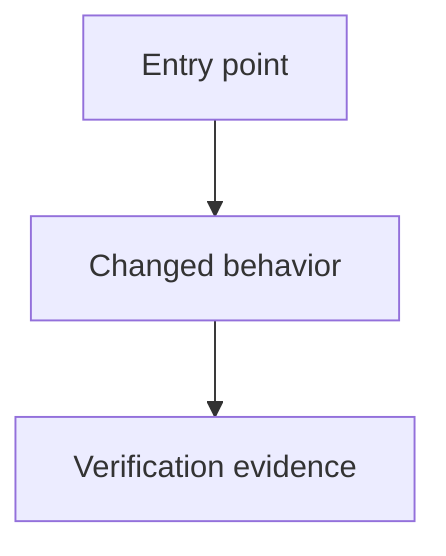

<!-- SPDX-FileCopyrightText: 2025-2026 Tyrone Ross, Jr <46267523+tyroneross@users.noreply.github.com> | SPDX-License-Identifier: Apache-2.0 -->

# Review-G Comprehension Artifact

## Scope

- Run:
- Trigger reasons:
- Diff range:
- Changed files:

## Architecture Sketch



## Self-Grill

1. What invariant must remain true after this change?
2. What failure mode would the current tests miss?
3. Which changed file is hardest to review, and why?
4. What rollback or containment path exists if the change is wrong?

## Simplicity Metrics

```json
{
  "net_loc": 0,
  "complexity_delta": null,
  "dependency_delta": {
    "manifest_files_changed": [],
    "added": [],
    "removed": []
  },
  "new_abstractions": []
}
```
